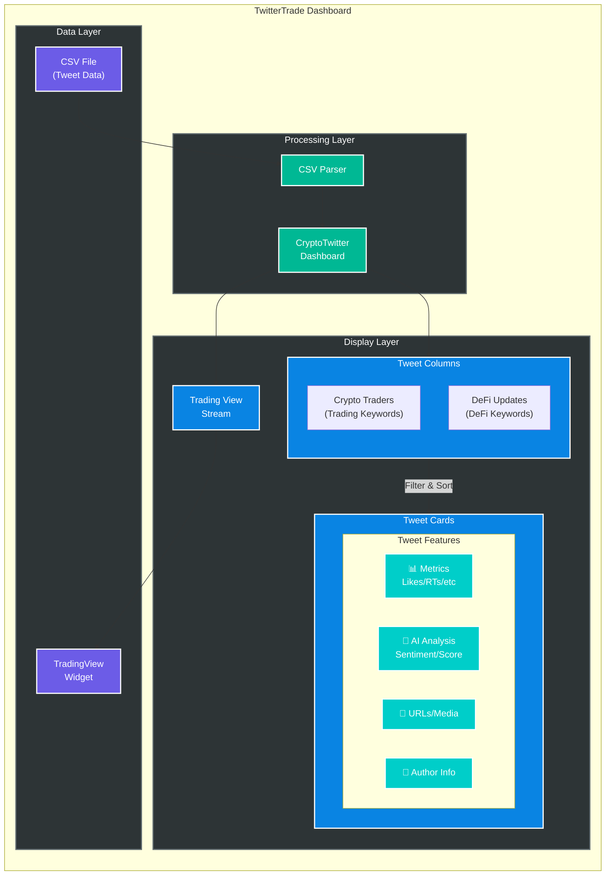

```mermaid
graph TB
    %% Main Layout Direction: Top to Bottom
    
    subgraph TwitterTrade ["TwitterTrade Dashboard"]
        direction TB
        
        subgraph DataLayer ["Data Layer"]
            direction LR
            CSV["CSV File<br/>(Tweet Data)"]
            TradingView["TradingView<br/>Widget"]
        end
        
        subgraph ProcessingLayer ["Processing Layer"]
            direction LR
            CSVParser["CSV Parser"]
            Dashboard["CryptoTwitter<br/>Dashboard"]
        end
        
        subgraph DisplayLayer ["Display Layer"]
            direction LR
            subgraph Columns ["Tweet Columns"]
                direction TB
                CryptoTraders["Crypto Traders<br/>(Trading Keywords)"]
                DeFiUpdates["DeFi Updates<br/>(DeFi Keywords)"]
            end
            
            subgraph Cards ["Tweet Cards"]
                direction LR
                subgraph Features ["Tweet Features"]
                    Metrics["📊 Metrics<br/>Likes/RTs/etc"]
                    AIAnalysis["🤖 AI Analysis<br/>Sentiment/Score"]
                    Links["🔗 URLs/Media"]
                    Author["👤 Author Info"]
                end
            end
            
            StockStream["Trading View<br/>Stream"]
        end
    end
    
    %% Connections
    CSV --> CSVParser
    CSVParser --> Dashboard
    Dashboard --> Columns
    Dashboard --> StockStream
    StockStream --> TradingView
    
    Columns --> |"Filter & Sort"| Cards
    
    %% Styling
    classDef layer fill:#2d3436,stroke:#636e72,stroke-width:2px,color:#fff;
    classDef data fill:#6c5ce7,stroke:#fff,stroke-width:2px,color:#fff;
    classDef process fill:#00b894,stroke:#fff,stroke-width:2px,color:#fff;
    classDef display fill:#0984e3,stroke:#fff,stroke-width:2px,color:#fff;
    classDef features fill:#00cec9,stroke:#fff,stroke-width:2px,color:#fff;
    
    class DataLayer,ProcessingLayer,DisplayLayer layer;
    class CSV,TradingView data;
    class CSVParser,Dashboard process;
    class Columns,Cards,StockStream display;
    class Metrics,AIAnalysis,Links,Author features;
```